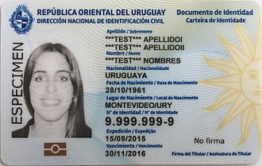

About Uruguayan id numbers
==========================

In Uruguay, each person is issued an identity card, which contains all 
the necessary information to identify the owner unequivocally.

This document is mandatory for all inhabitants Uruguay, whether they are
native citizens, legal citizens, or resident aliens in the country, 
even for children as young as 45 days old.

   Sample Uruguayan id card.

Each person is issued an identiy number (which is decided at birth for
native citizens), which contains 7 digits and a validation number. Old 
identity number contain only 6 digits, and a validation number.

Calculating the validation number
---------------------------------

In order to calculate the validation number for a 7-digit id number, the
number must be multiplied, digit by digit, by 8123476. Then the rsult is
added. So if the number is interpreted as a 7 dimensional vector, one must
calculate the dot product of said vector by ``<8, 1, 2, 3, 4, 7, 6>``\ .

Then, if the resulting number is ``n``\ , the validation digit will be ``n`` 
modulo 10.

Validating 6-digit numbers
^^^^^^^^^^^^^^^^^^^^^^^^^^

6 digit numbers should be multiplied by ``<1, 2, 3, 4, 7, 6>``\ instead. 
Given ``n``\ , the resulting number, then the validation digit will be ``n`` 
modulo 10.

An example
^^^^^^^^^^

Validating 1.234.567:

.. math::

    &<1, 2, 3, 4, 5, 6, 7> . <8, 1, 2, 3, 4, 7, 6> = \\
    &\; 1*8 + 2*1 + 3*2 + 4*3 + 5*4 + 6*7 + 7*6 = 132\\
    &\\
    &132 \: modulo \: 10 = 2

So the validation digit is ``2``\ . The id number would normally be written
as 1.234.567-2.
